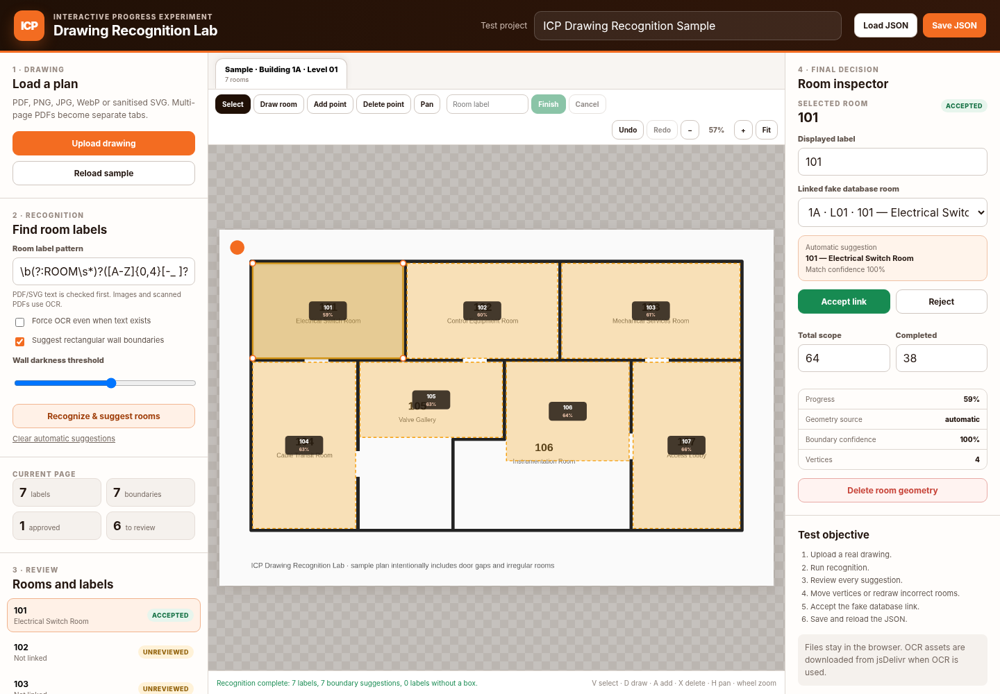

# ICP Drawing Recognition Lab

Standalone TypeScript prototype for testing the difficult part of the future ICP **Interactive Progress** feature:



- upload PDF, PNG, JPG, WebP or SVG drawings;
- render multi-page PDFs as page tabs;
- read labels from PDF text layers and SVG text;
- use browser OCR for image/scanned drawings;
- suggest simple room boundaries by looking for dark walls around a label;
- review every automatic match before it is accepted;
- draw and edit irregular room polygons manually;
- save/reload the complete test project as JSON.

This is intentionally separate from the main ICP application. It uses framework-free TypeScript files compiled into one `docs/app.js`.

## Current limits

The automatic boundary finder suggests **box-like boundaries only**. Door gaps are tolerated, but irregular rooms, complex linework, annotations, columns and curved walls require manual correction. Automatic matching never approves a room: the user must accept the fake database link.

OCR is provided by Tesseract.js and downloads its worker, WebAssembly core and English model from public CDNs when it is first used. PDF rendering is provided by PDF.js from jsDelivr. The uploaded drawing itself is not sent to an ICP server by this prototype, although the browser OCR library processes it locally after its assets have downloaded.

## Run locally

Node.js 20 or newer is required.

```bash
npm install
npm run verify
npx http-server docs -p 8080
```

Open `http://localhost:8080`.

## Build output

```text
src/*.ts       TypeScript source files
public/*       Static HTML, CSS and sample drawing
docs/app.js    Single generated JavaScript bundle
docs/*         GitHub Pages-ready site
```

`npm run build` recreates `docs/` from `public/` and compiles all TypeScript namespaces into one `app.js`.

## GitHub Pages deployment

1. Create a new GitHub repository.
2. Upload/commit this project to the `main` branch.
3. Open **Settings → Pages**.
4. Set **Source** to **GitHub Actions**.
5. Push to `main` or run the **Build and deploy GitHub Pages** workflow manually.

The included workflow verifies TypeScript, runs geometry/matching tests, builds `docs/`, and deploys it.

A simpler alternative is to publish from the `main` branch `/docs` folder because the built site is committed in the package.

## Test workflow

1. Reload the sample and run **Recognize & suggest rooms**.
2. Select each suggested room and decide whether its fake database match is correct.
3. Move a whole polygon with **Select**.
4. Drag individual orange vertex handles.
5. Use **Add point** for irregular rooms and **Delete point** to remove a vertex.
6. Select a label that has no boundary and choose **Draw this room**.
7. Save the project JSON and load it again.
8. Repeat with real construction PDFs and scanned images.

## Suggested evidence to record

For each drawing, record:

- total room labels expected;
- labels found from native PDF text;
- labels found by OCR;
- correct database suggestions;
- boundaries automatically created;
- boundaries accepted without changes;
- boundaries requiring edits or redraw;
- time required for the user to finish the drawing.

That evidence will determine whether the recognition layer is useful enough and which parts should later move into the main ICP backend.
